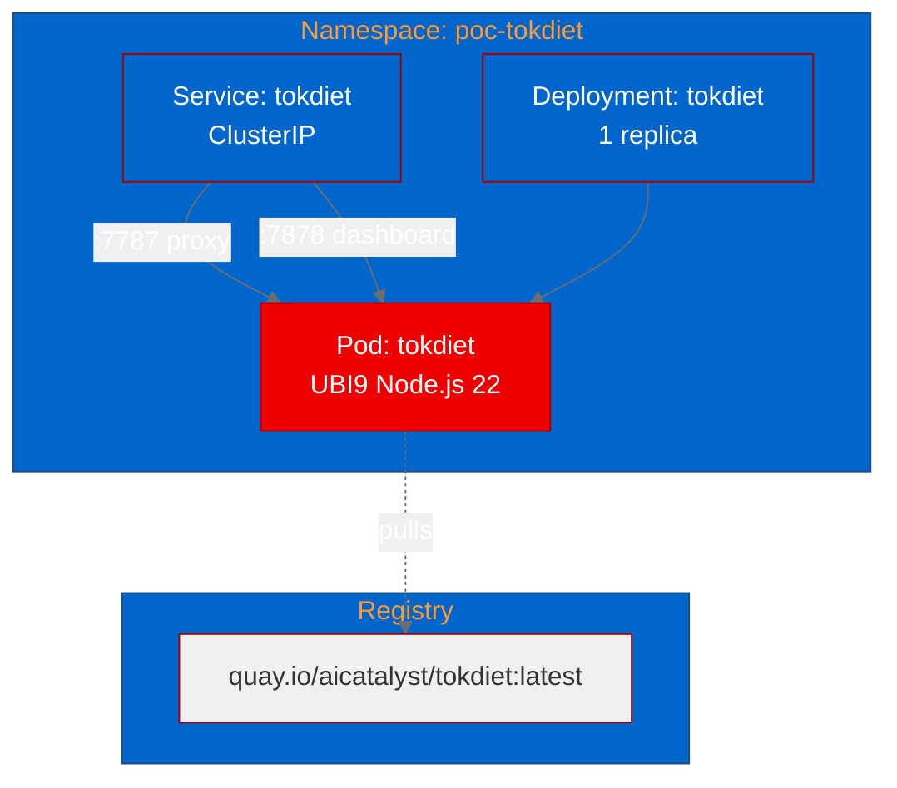

# PoC Report: TokDiet LLM Token Proxy on OpenShift

## Executive Summary

TokDiet, an LLM token metering and context compaction proxy, was successfully deployed to OpenShift using UBI-based containers. The proof-of-concept validated that the proxy and its live dashboard can run as a containerized service on Kubernetes, with all three test scenarios passing. The project demonstrates strong potential as a cost-optimization tool for AI workloads running on OpenShift AI.

**Result: SUCCESS** - All 3/3 tests passed. The proxy and dashboard are fully operational.

## Project Analysis

| Property | Value |
|----------|-------|
| **Project** | TokDiet |
| **Source** | https://github.com/agiwhitelist/tokdiet |
| **License** | MIT |
| **Language** | TypeScript (Node.js, ESM) |
| **Classification** | API Service (Reverse Proxy) |
| **RHOAI Fitness Score** | 74/100 |

### Component Summary

| Component | Language | Build System | Ports | ML Workload |
|-----------|----------|-------------|-------|-------------|
| tokdiet | TypeScript | npm | 7787 (proxy), 7878 (dashboard) | No |

### Key Features

- **Token Metering**: Tracks input/output tokens and cost per request across Anthropic, OpenAI, and Gemini providers
- **Context Compaction**: Reduces bloated agent context by ~71% using elision, dedup, and mid-history summarization
- **Quality Guard**: Shadow evaluation ensures compaction does not degrade answer quality beyond a configurable budget
- **Live Dashboard**: Real-time SSE-streamed telemetry with usage breakdown, cost tracking, and compaction metrics
- **SQLite Telemetry**: Persistent request-level metrics with export to JSON/CSV

## PoC Objectives

1. Build TokDiet from source using UBI-based Node.js container
2. Deploy to OpenShift with proper service networking
3. Validate dashboard and proxy endpoints are accessible in-cluster
4. Demonstrate container-readiness for production deployment

## Pipeline Execution Summary

### Phase Details

| Phase | Status | Duration | Notes |
|-------|--------|----------|-------|
| 1. Intake | Completed | - | Repository cloned, single component identified |
| 2. Evaluate | Completed | - | Score: 74/100, strategy areas: agentic-ai, developer-experience |
| 3. Fork | Completed | - | Forked to https://github.com/aicatalyst-team/tokdiet |
| 4. PoC Plan | Completed | - | api-service classification, 3 test scenarios defined |
| 5. Containerize | Completed | - | UBI9 Node.js 22, source patched for 0.0.0.0 binding |
| 6. Build | Completed (retry 1) | ~2 min | First attempt failed (multi-stage chgrp errors), fixed with single-stage build |
| 7. Deploy | Completed | - | Deployment + Service with two ports |
| 8. Apply | Completed (probe fix) | ~3 min | Initial readiness probe used wrong path (/stats), fixed to /api/summary |
| 9. PoC Execute | Completed | ~1s | All 3 tests passed on first attempt |
| 10. PoC Report | Completed | - | This document |

### Challenges and Resolutions

1. **Hardcoded 127.0.0.1 Binding**: Both the proxy (`proxy.ts:1157`) and dashboard (`dashboard.ts:179`) hardcode binding to `127.0.0.1` for security (preventing open relay). Resolution: `sed` patches in Dockerfile replace the hardcoded address with `process.env.TOKDIET_HOST || '0.0.0.0'`, controlled by the `TOKDIET_HOST` environment variable.

2. **Multi-stage Build Failure**: Initial Dockerfile used a multi-stage build with `nodejs-22-minimal` runtime. The `chgrp -R 0 /opt/app-root` command failed on base image files owned by other UIDs. Resolution: Switched to single-stage build with scoped `chgrp`/`chmod` on application directories only.

3. **Readiness Probe Misconfiguration**: Initial probe targeted `/stats` which does not exist in the dashboard API. The dashboard serves: `/` (SPA), `/events` (SSE), `/api/summary` (JSON), `/api/recent` (JSON). Resolution: Changed probe path to `/api/summary`.

## Test Results

| Scenario | Status | Duration | Details |
|----------|--------|----------|---------|
| health-check | PASS | 0.02s | GET /api/summary returned 200 with valid JSON telemetry |
| dashboard-ui | PASS | <0.01s | GET / returned 200 with HTML dashboard SPA |
| proxy-status | PASS | 0.64s | GET / on proxy port returned 404 (port is listening, proxy requires POST with JSON) |

## Infrastructure Deployed

### Resource Allocation

| Resource | Request | Limit |
|----------|---------|-------|
| CPU | 250m | 500m |
| Memory | 256Mi | 512Mi |

### Deployed Resources

- **Namespace:** poc-tokdiet
- **Deployment:** tokdiet (1 replica, quay.io/aicatalyst/tokdiet:latest)
- **Service:** tokdiet (ClusterIP, ports 7787/TCP + 7878/TCP)
- **Image Pull Secret:** quay-pull-secret

## Recommendations

### For Production Deployment

1. **Keep loopback default in production**: TokDiet is designed as a per-developer local proxy. For shared/platform deployment, the 0.0.0.0 binding should be carefully considered alongside network policies to prevent unauthorized access to the proxy (which forwards API keys).

2. **Add NetworkPolicy**: Since the proxy forwards API keys, restrict ingress to only authorized pods/namespaces.

3. **Persistent SQLite storage**: Add a PVC for `/opt/app-root/src/.tokdiet/` to persist telemetry data across pod restarts.

4. **Resource tuning**: The current profile (256Mi/250m) is adequate for light usage. Scale based on expected concurrent agent connections.

5. **Upstream contribution**: Consider contributing the `TOKDIET_HOST` environment variable support upstream to avoid source patching.

### OpenShift AI / ODH Considerations

- **AI Cost Management**: TokDiet fills a gap in the RHOAI ecosystem for LLM cost visibility and optimization
- **Integration Point**: Could be deployed as a platform-level proxy for all AI workloads in a namespace
- **Dashboard**: The built-in SSE dashboard provides immediate value without external monitoring setup
- **No GPU Required**: Runs on standard worker nodes, no special hardware allocation needed

## Appendix

### Links

| Resource | URL |
|----------|-----|
| Source Repository | https://github.com/agiwhitelist/tokdiet |
| Fork Repository | https://github.com/aicatalyst-team/tokdiet |
| Container Image | quay.io/aicatalyst/tokdiet:latest |
| Evaluation | `.autopoc/rhoai-evaluation.md` |
| PoC Plan | `poc-plan.md` |
| Test Script | `poc_test.py` |
| Kubernetes Manifests | `kubernetes/` |

### Environment

| Component | Version/Details |
|-----------|-----------------|
| Base Image | registry.access.redhat.com/ubi9/nodejs-22:latest |
| Node.js | 22.x (UBI9) |
| Build Strategy | OpenShift Binary Build |
| Cluster | OpenShift (autopoc-test namespace prefix) |
